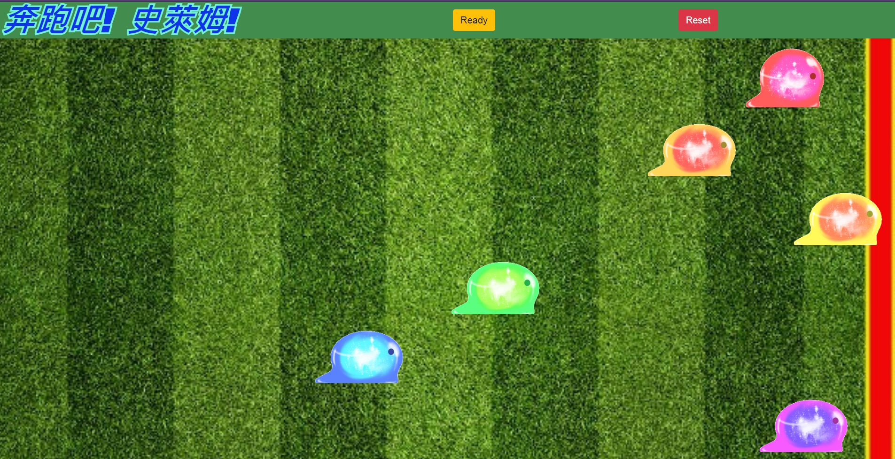
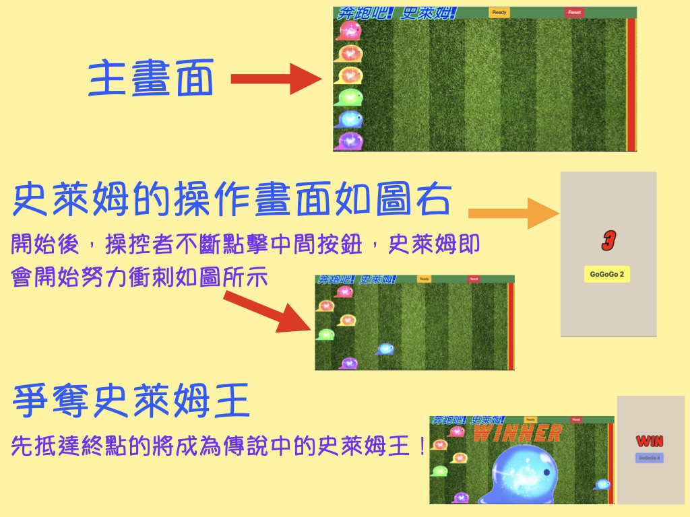

# Slime Racing
### A real-time game develops with SignalR.

## Introduction

### Race Track URL
http://localhost:5010

### Slime Joystick URLs
* 紅色史萊姆(Red Slime)       : http://localhost:5010/speedo/0  
* 橘色史萊姆(Orange Slime)    : http://localhost:5010/speedo/1  
* 黃色史萊姆(Yellow Slime)    : http://localhost:5010/speedo/2  
* 綠色史萊姆(Green Slime)     : http://localhost:5010/speedo/3  
* 藍色史萊姆(Blue Slime)      : http://localhost:5010/speedo/4  
* 紫色史萊姆(Purple Slime)    : http://localhost:5010/speedo/5  

## Publish
`dotnet publish -c Release -r linux-x64 --self-contained false -o bin\Release\netcoreapp3.1\SlimeRacingPublisher`

`dotnet publish -c Debug -r linux-x64 --self-contained false -o bin\Release\netcoreapp3.1\SlimeRacingPublisher`

## Prerequisites

* [.NET Core](https://www.microsoft.com/net/download/windows) >= 3.1
* Your favorite editor VS Code or VS 2019. (I prefer [VS Code](https://code.visualstudio.com/))

## Status Code

Standard Code | Description            | Note 
:------------:| ---------------------- |-----:
200           | OK, Success            |   
400           | Bad request            |   
401           | Unauthorized           |
403           | Forbidden              |
404           | Not Found              |
405           | Method Not Allowed     |
408           | Request Timeout        |
415           | Unsupported Media Type |
500           | Internal Server Error  |
502           | Bad Gateway            |
503           | Service Unavailable    |